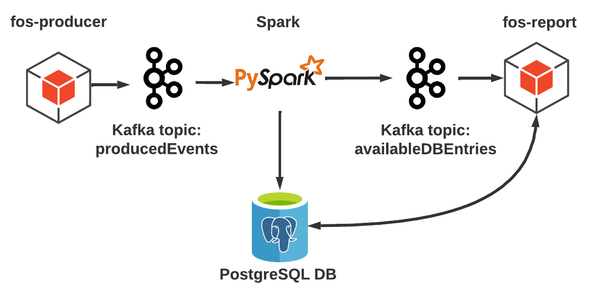
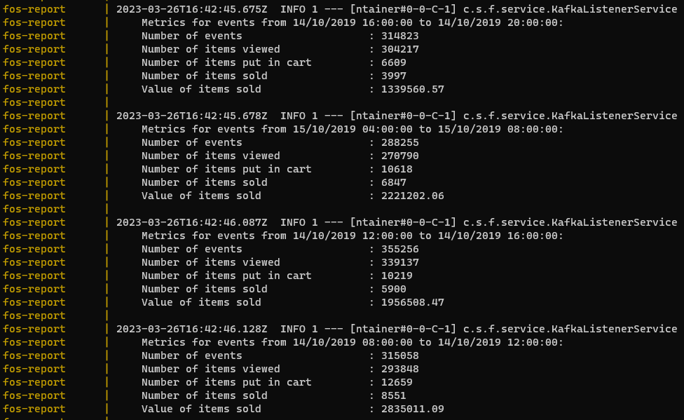
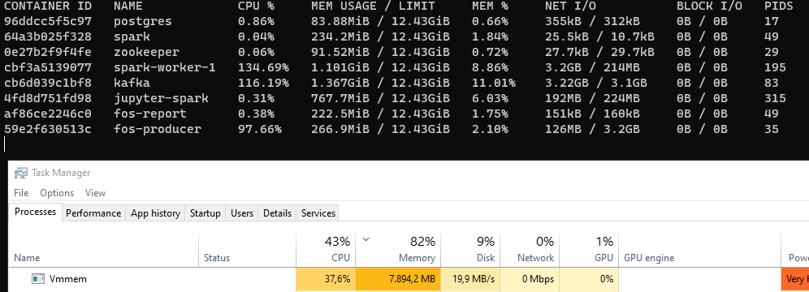

<h1>FOS: Fictive Online Store</h1>


This is a computer science big data streaming demo project. 
It contains a fos-producer microservice mocking user events generated by an e-commerce store, 
Kafka messaging, PySpark for aggregating the user event to metrics, 
a PostgreSQL DB for storing the metrics and a fos-report consumer microservice for logging the metrics.

<h2>Architecture</h2>
<h3>Components</h3>



<ul>
<li>
<strong>fos-producer</strong>: Spring boot microservice, responsible for mocking user events and sending them to the producedEvents Kafak topic. 
The events are read from a csv and produced according to the contained timestamps. The event production speed can be adjusted by configuration.
</li>
<li>
<strong>Spark</strong>: PySpark structured streaming service for consuming the events from the producedEvents topic and transforming them. 
The data is windowed per second and aggregated to the metrics described in the data flow section below. The aggregated data is then saved to the DB, with the time window and the number of events as primary keys.
Also fos report is notified over the availableDBEntries topic about the existence of new data in the DB which can be read.
</li>
<li>
<strong>fos-report</strong>: Spring boot microservice, responsible for reading and displaying aggregated data.
The service listens to new messages on the availableDBEntries topic, retrieves the corresponding data from the DB and logs it.
In a real world use case, this would be the service to expose the data to the interface partners which use the data.
</li>
<li>
<strong>PostgreSQL DB</strong>: Standard relational DB for saving the by Spark aggregated metrics. 
The events table containing the data is purged on ever Docker container startup to have a clean startup for every run.
</li>
</ul>
<h3>Data flow</h3>
<p>
Raw user events are created by fos-producer, reading them from the CSV file and sending them to the producedEvents topic.
Spark continuously reads them and windows them per one second. This is a real world one second, meaning that independently of how fast the raw event production is configured, there will be always be one DB entry per second created.
E.g. if PRODUCER_DATA_SEC_PER_REAL_SEC is set to 60, one DB entry contains the data which are timestamped within 60 seconds.
This way all components after the Spark components in terms of data flow always receive the same load and don't have to worry about scalability.
Because of the parallelism implemented in Spark, it might be the case that data arrives after the DB entry for it's time window has already been created.
Unfortunately, PySpark structured streaming doesn't support UPSERT DB operations as of now, therefore a new DB entry for the window with a higher number of events will be created.
After the saving the DB entry, Spark informs fos-report about the availability of the new data over the availableDBEntries topic. 
Fos-report retrieves the DB entry and logs the following metrics, representing the final output:
</p>
<ul>
<li>Timestamps from when to when the metrics are aggregated</li>
<li>Number of events aggregated</li>
<li>Number of items viewed</li>
<li>Number of items put in cart</li>
<li>Number of items sold</li>
<li>Value of items sold</li>
</ul>

<h2>Local setup</h2>
<ol>
<li>Download Docker Desktop (if not already installed) and make sure the docker deamon is running.</li>
<li>Clone or download and unzip the repository.</li>
<li>The repository includes only a small subset of data for development purposes, due to the full data set being 5GB in size. 
For testing with the full data set please download '2019-Oct.csv' at (https://www.kaggle.com/datasets/mkechinov/ecommerce-behavior-data-from-multi-category-store?resource=download&select=2019-Oct.csv).
The file needs to be placed in the 'data' folder and the INPUT_FILE_NAME at the top of the .env needs to be adjusted to the new file name.
</li>
<li>You may change other configurations as desired, see configuration section.</li>
<li>Open a shell at the root of the project and run

```
docker compose up --build
```

</li>
<li>The containers should start and after a startup period (may take quite long for the first time, due to the docker images being several GB in size) 
you should be able to observe in the opened shell fos-producer sending events and fos-report logging the aggregated metrics.</li>
</ol>

<h4>Trouble shooting</h4>
Issues you may encounter and how to resolve.
<ul>
<li>
You get a maven related error when fos-producer/fos-report are being built -> 
this is an internet connectivity issues with maven central. 
Simply trying again after a few seconds usually resolves it.
</li>
<li>
The Kafka container crashes on startup -> you may have not shut down Kafka cleanly on the last time you ran the application.
Try again after performing

```
docker compose down
```

</li>
<li>
Experiencing severe performance issues, with fos-report not producing any output after running the application for longer times with a high PRODUCER_DATA_SEC_PER_REAL_SEC value.
May also happen in the first run when the images are being pulled. ->
Docker Desktop may experience performance leaks. The easiest way to resolve this is just to restart the PC.
</li>
</ul>


<h2>Configuration</h2>
The following configurations can be adjusted in the .env file in the root of the project.
<ul>
<li>
INPUT_FILE_NAME: needs to match the name of the csv to read from the data folder.
Should fos-producer crash on startup and throw and exception, you may have misconfigured this value.
</li>
<li>
PRODUCER_DATA_SEC_PER_REAL_SEC: determines how fast data is read from the csv. 
1 is real time, 60 e.g. means 1 minute of csv data is sent per real time second. 
Probably the main configuration you want to adjust to do loadtests of different sizes.
</li>
<li>
PRODUCER_STARTUP_DELAY_IN_SEC: small delay before event production is started, just so all container can settle and are ready.
You may want to adjust this value if containers for some reason need to take longer to get up and running on your machine, but normally you should not need to touch this setting.
</li>
<li>
PRINT_PRODUCER_LOGS: when set to false, disables log messages for events being produced by fos-producer.
May be useful on a high PRODUCER_DATA_SEC_PER_REAL_SEC setting, to avoid spam.
</li>
</ul>


<h2>Performance</h2>
The main limitation of the load the system is able to manage is the available memory.
Using PRODUCER_DATA_SEC_PER_REAL_SEC=14400 (4 hours of data per second), 
we can see that the system is able the handle around 300000 messages per second at 8GB memory usage (however this value may be inaccurate due to Docker desktop memory leaks).



